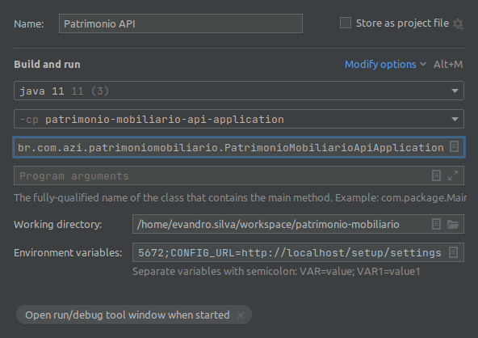

# Patrimônio Mobiliário

Esta aplicação um módulo do SIGA Patrimônio, 
que tem por objetivo gerenciar todo o histórico de vida de um bem móvel.

Bem móvel é o item tangível que é mantido para o uso na produção ou fornecimento de bens ou serviços, 
ou para fins administrativos, inclusive os decorrentes de operações que transfiram para a entidade os 
benefícios, riscos e controle desses bens, cuja utilização se dará por mais de um exercício.


## Arquitetura
???

## Como desenvolver

#### PASSO 1 - Instale a CLI do hal globalmente
Este CLI irá prover comandos que te ajudarão a subir parte dentro do docker e parte fora dele.

```bash
npm i hal-cli -g
```

#### PASSO 2 - Execute o comando abaixo na pasta raiz do repositório
Este comando irá subir todas as dependências do docker que esta aplicação depende para ser executado.

```bash
hal up
```

#### PASSO 3 - Suba a Api pela IDE
Para subir a API, utilize a funcionalidade *Run Configurations* do IntelliJ.
Na criação da Run Configuration selecione o módulo `patrimonio-mobiliario-api-application` e selecione a classe
principal do projeto `br.com.azi.patrimoniomobiliario.PatrimonioMobiliarioApiApplication`.
Em seguida, de acordo com o banco de dados que irá utilizar, copie as variáveis de ambiente abaixo para o campo de `Environment Variables` no seu Run Configuration.

###### Váriaveis de ambiente para banco Postgres
```bash
HAL_CONFIG_URL=http://localhost:8000
HAL_DISCOVERY_URL=http://localhost:8001
HAL_URL=http://localhost/setup/hal
DATABASE_URL=jdbc:postgresql://localhost:5432/az
DATABASE_CLASSNAME=org.postgresql.Driver
DATABASE_USERNAME=postgres
DATABASE_PASSWORD=postgres
DATABASE_PLATFORM=org.hibernate.dialect.PostgreSQLDialect
DATABASE_VALIDATION_QUERY=SELECT 1
LIQUIBASE_CONTEXTS=desenv
RABBITMQ_HOST=rabbitmq
RABBITMQ_PORT=5672
CONFIG_URL=http://localhost/setup/settings
```

###### Váriaveis de ambiente para banco SQL Server
```bash
HAL_CONFIG_URL=http://localhost:8000
HAL_DISCOVERY_URL=http://localhost:8001
HAL_URL=http://localhost/setup/hal
DATABASE_URL_NODB=jdbc:sqlserver://localhost:1433\;
DATABASE_URL=jdbc:sqlserver://localhost:1433;databaseName=az;
DATABASE_NAME=az
DATABASE_CLASSNAME=com.microsoft.sqlserver.jdbc.SQLServerDriver
DATABASE_USERNAME=sa
DATABASE_PASSWORD=S3nha@123
DATABASE_PLATFORM=org.hibernate.dialect.SQLServer2012Dialect
DATABASE_VALIDATION_QUERY=SELECT 1
LIQUIBASE_CONTEXTS=desenv
EFORNECEDOR_URL=http://localhost/efornecedor/efcaz-api
RABBITMQ_HOST=localhost
RABBITMQ_PORT=5672
```

Exemplo de como deve ficar o seu Run Configuration:



#### PASSO 4 - Suba o frontend pela IDE
Basta entrar na subpasta do projeto frontend, executar o comando `npm install` (somente para a primeira vez subindo o 
projeto, para instalar as dependências) e logo após executar o comando `npm run serve`.

#### PASSO 5 - Atualize o gateway com o seu IP
Na pasta raiz do produto execute o comando `hal update-gateway` para o gateway saber redirecionar
para a sua máquina quando acessar o frontend.

#### PASSO 6 - Acesse o projeto
Pronto, basta acessar: http://localhost/patrimonio-mobiliario/

## Usuário em ambiente de desenvolvimento

Em ambiente de desenvolvimento nós temos o usuário abaixo para teste:

Login:
```bash
admin
```

Senha:
```bash
123
```

-----

© Copyright 2020 - All rights reserved | Todos os direitos Reservados

__AZ Tecnologia em Gestão__
