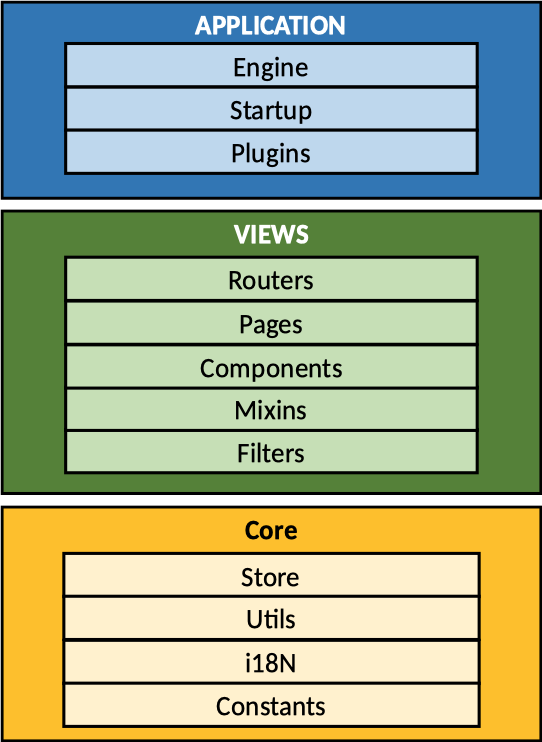

### 1. Objetivo

Este documento tem como objetivo repassar o conhecimento técnico da arquitetura adotada no front-end do produto Patrimônio Mobiliário.

### 2. Sobre a arquitetura

Divida em quatro camadas (application, core, plugins, views), a arquitetura adotada neste projeto impõe algumas restrições de implementação que devem ser seguidas para garantir que a manutenção e a evolução do software seja feita de forma rápida e eficaz.


### 3. Descrição das camadas

A seguir uma breve descrição de cada camada, suas tecnologias e responsabilidades.



#### 3.1 Application

A camada de aplicação é responsável por realizar o processamento que antecede o início da aplicação Vue e em seguida criar a instância Vue da aplicação.

Responsabilidades:

* Registrar os mixins.
* Executar todos os listeners e buscar informações necessárias para o início da aplicação (ex: registrar os interceptadores de requests do axios).
* Registrar todos os plugins utilizados no projeto.
* Registrar todos os componentes .vue do projeto.
* Criar instância da aplicação vue.

#### 3.2 Core

Semelhante a camada de interface da arquitetura clean, o core armazena as classes responsáveis por realizar a comunicação com o back-end.

Responsabilidades:

* Implementar a comunicação com o back-end através das classes __ApiClient__.
* Implementar as constantes utilizadas na aplicação.
* Implementar o tratamento global de exceções da aplicação.
* Implementar o gerenciamento de estados da aplicação com Vuex.
* Implementar as classes utilitárias.

#### 3.3 Plugins

Responsável por manter de forma organizada as configurações das bibliotecas de terceiros utilizadas no projeto, com exceção do axios que é carregado e configurado diretamente na camada de aplicação, para cada lib presente no projeto, é criado um arquivo .js que importa a biblioteca e a configura se necessário.  

Exemplo do arquivo vuetify.js:

```javascript
import Vue from 'vue'
import Vuetify from 'vuetify'
import 'vuetify/dist/vuetify.min.css'
import pt from 'vuetify/es5/locale/pt'

Vue.use(Vuetify, {
    lang: {
        locales: { pt },
        current: 'pt'
    },
    theme: {
        primary: '#4a9246',
        secondary: '#ed8732'
    },
    options: {
        customProperties: true
    }
})

```

A camada de aplicação consome todos os plugins e realiza o registro de cada no processo que é descrito no ítem 3.1.

Responsabilidades:

* Implementar e configurar os plugins utilizados no projeto.

#### 3.4 Views

Semelhante a camada de UI da arquitetura clean, a camada Views contém todas as telas e componentes Vue utilizados no projeto. Além disso também é responsável por manter todas as rotas e suas restrições de regra de negócio.  
Os componentes são globalmente registrados no início da aplicação, portanto não é necessário importá-los nas páginas.

Responsabilidades:

* Implementar as páginas da aplicação.
* Implementar as rotas da aplicação.
* Implementar os componentes globais da aplicação.

-----

© Copyright 2020 - All rights reserved | Todos os direitos Reservados

__AZ Tecnologia em Gestão__
